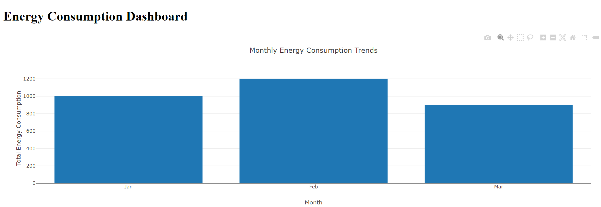
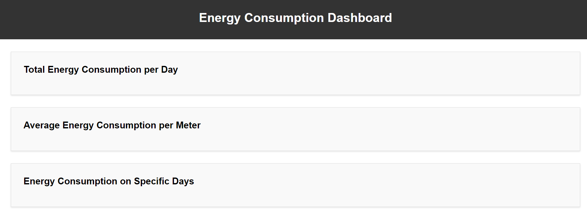

# Energy Consumption Monitoring using Snowflake

  

---

## Project Description

This project aims to create a comprehensive data analysis and visualization platform for monitoring energy consumption using Snowflake. The project involves collecting data from smart meters, processing it through Snowflake's powerful data warehousing capabilities, and providing meaningful insights through interactive visualizations.

---

## Features

- Ingest and process energy consumption data from smart meters.
- Utilize Snowflake's data warehousing capabilities for efficient data storage and analysis.
- Generate insights through interactive visualizations that highlight consumption trends and patterns.

---

## Technologies Used

- Snowflake
- SQL
- HTML/CSS (for visualization)

---

## Getting Started

1. Clone this repository to your local machine.
2. Navigate to the `scripts` directory and run the `process_data.sql` script to load and process sample data.
3. Open the `index.html` file in the `visualizations` directory to view the interactive energy consumption dashboard.

---

## Project Screenshots

  
   
  

---

## Acknowledgements

Special thanks to the Snowflake community for their support and resources.

---

Feel free to reach out for any questions or feedback!

